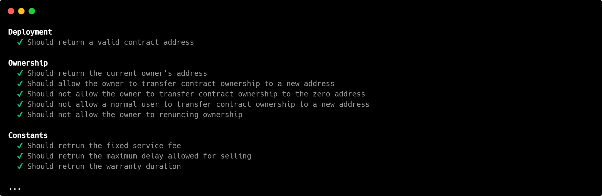

<div align="center">
    <p>
        <picture>
            <source media="(prefers-color-scheme: dark)" srcset="demo/static/assets/logo/logo-extended-dark.png">
            
        </picture>
    </p>
    <div>
        
        
        
        
        
    </div>
</div>

# Table of Contents

- [What is Janus](#what-is-janus)
    - [Motivations](#motivations)
    - [How does it work?](#how-does-it-work)
    - [Why Janus?](#why-janus)
- [Installation and Configuration](#installation-and-configuration)
    - [Node.js](#-nodejs)
    - [Python](#-python)
    - [Remix - Ethereum IDE](#remix---ethereum-ide)
        - [Remix Desktop IDE (preferred)](#remix-desktop-ide-preferred)
        - [Remix Online IDE](#remix-online-ide)
    - [MetaMask](#metamask)
- [Getting Started](#getting-started)
    - [Running Tests](#running-tests)
    - [Play with the contract](#play-with-the-contract)
- [Demo](#demo)
    - [Disclaimer](#disclaimer)
    - [How to run the demo](#how-to-run-the-demo)
    - [Best way to use the demo](#best-way-to-use-the-demo)
    - [Screenshots](#screenshots)
- [Contacts](#contacts)

# What is Janus

## Motivations

Cryptocurrencies are increasingly used worldwide, but for many, this method of payment remains mysterious and, at times, unreliable—especially due to associations with the dark web and lack of oversight. Despite this, a growing number of legitimate businesses are adopting cryptocurrencies to reach new customer segments.

However, there are still very few safeguards when using cryptocurrencies as a form of payment. Once funds are sent, they’re gone, and buyers must fully trust the seller’s integrity. As the internet has shown us time and again, that trust is not always justified—regardless of the payment method.

This is where **Janus** comes in. Janus is a smart contract designed to offer **security and guarantees to buyers**, while helping **sellers build trust** with their customers and increase sales.

## How does it work?

When a buyer wishes to purchase something using cryptocurrency, instead of sending funds directly to the seller, the payment is sent to the **Janus smart contract**, where it is held in escrow for a fixed period (30 days).

Once the payment is made, the **seller must confirm the order**. During this 30-day "warranty" period, if the buyer experiences any issues, they can request a refund. Janus then initiates an **anonymous communication process** between buyer and seller to gather details. Based on the outcome, the refund request is either approved or declined.

- If **approved**, the buyer can withdraw their funds, minus network fees.
- If **declined**, or if no issue arises during the 30 days, the seller becomes eligible to withdraw the funds. In this case, a fixed fee of **1%** is applied.

Of course, services similar to Janus already exist. However, most of them rely on **custodial wallets**, meaning a third-party entity holds your funds on your behalf. To create such a wallet, you're typically required to **verify your identity**, often by submitting official documents. As a result, in the event of a dispute, the details of your transaction—and potentially your personal information—may be shared with the service provider to assist in resolving the issue.

While this may help facilitate a resolution, it comes at a cost: it **compromises the core principle of anonymity** that cryptocurrencies were built upon.

Janus takes a different approach. While the concept is similar—offering protection during transactions—we do **not require any form of identity verification**. You are identified solely by your **wallet address**. We have no access to your personal information, and any data you provide during a refund request **cannot be linked back to you**.

This allows you to enjoy the same level of **security and buyer protection**, while maintaining full control over your funds through **custodial and non-custodial wallets** (such as MetaMask).

## Why Janus?

If you're wondering about the name, the answer is quite straightforward. In ancient Roman religion and mythology, **Janus** is the god of **beginnings**, symbolizing transitions and new ventures—much like the start of a transaction in our case.

Janus is traditionally depicted with **two faces**, looking in opposite directions. For us, these faces represent the **buyer and the seller**, the two parties involved in every trade.

The name also reflects a deeper message: the **end of uncertainty and conflict**—where buyers lacked guarantees and sellers struggled to build trust—and the **beginning of mutual trust and security**, with our system providing the protection both sides need.

**Ready to take the next step?**

# Installation and Configuration

First, clone this repository by running `git clone https://github.com/christiansassi/blockchain-project`

##  Node.js

1. Download and install Node.js from [here](https://nodejs.org/en/download/package-manager).
2. Install the required packages by running `npm install`

##  Python

1. Download and install Python from [here](https://www.python.org/downloads/).
2. Install the required packages by running `pip install -r requirements.txt`

##  Remix - Ethereum IDE
        
### Remix Desktop IDE (preferred)

1. Download and install Remix Desktop IDE from [here](https://github.com/remix-project-org/remix-desktop-insiders/releases).
2. After installation, click `File > Open Folder` in the top-left corner, then select your project folder.
    
### Remix Online IDE

1. Install the npm package by running `npm install @remix-project/remixd --global`
2. Start the Remix daemon inside your project directory. Navigate to your project folder and run `remixd -s .`
3. Open the Remix Online IDE [here](https://remix.ethereum.org/), and in the top-left corner, under the workspace section, select `connect to localhost`.

##  MetaMask

1. Download and intsall MetaMask from [here](https://metamask.io/download/).
2. Click on `+ Add Network > Add a custom network` and set the following:
   - **Network Name**: `Hardhat`
   - **RPC URL**: `http://127.0.0.1:8545`
   - **Chain ID**: `31337`
   - **Currency Symbol**: `ETH`

To import an account into MetaMask, you need to run a local Hardhat node. You can do this by running `npx hardhat node` in the root directory either now or later when using the demo. In either case, you will see a terminal window like the one below:

<div align="center">
    <p>
        
    </p>
</div>

To import an account into MetaMask, click on `+ Add account or hardware wallet` > `Private Key`, and paste the private key of the account you want to import.

# Getting Started

## Running Tests

These commands execute the test cases inside the [tests.js](test/tests.js) file. There are a total of 101 test cases designed to verify the correct functioning of the contract by creating various scenarios that test its functionalities and check for potential bugs in the contract logic. Specifically, the test cases also ensure that every `require` statement within the contract works as intended. However, it is important to note that some requirements *must always* be satisfied. In other words, at the time of development, we could not conceive of a specific test case capable of breaking these requirements.

You can run one of the following commands:

```bash
# Rebuild the contract before running the tests
npm run tests:compile

# Note that if the contract is not compiled, Hardhat will compile it for you
npm run tests
```

<div align="center">
    <p>
        
    </p>
</div>

## Play with the contract

1. In the Remix IDE, open the Solidity contract.
2. Click on `Solidity Compiler` in the left sidebar and compile the contract. 

> [!WARNING]
> You must use a compiler version `≥ 0.8.24` and enable optimization.  
> To do this, go to the `Solidity Compiler` tab, select the right compiler version and, by clicking on `Advanced Configurations`, check `Enable optimization`.

3. Click on `Deploy & Run Transactions` in the left sidebar and deploy the contract using the `Deploy` button.

You can now test the contract's functions by expanding the contract window within the `Deployed Contracts` section.

> [!WARNING]
> If you want to deploy the contract again, remove the already deployed contract by clicking on the trash icon.

> [!TIP]
> If you would like to reset the wallets (e.g., restore the balances), simply select and reselect the same environment (e.g., `Remix VM (Shanghai)`).

## Demo

### Disclaimer

As stated in the repository description, this project was developed for the Blockchain course at the University of Trento. Therefore, the development of a web application was not required and is considered an extra feature that goes beyond the original project scope.
As a result, the demo may contain bugs or edge cases that are not fully tested or handled, as well as code that could be significantly optimized. Nonetheless, the purpose of the demo is to provide a user-friendly interface for testing the smart contract and the associated service we have developed.

Additionally, to ensure complete anonymity of the service, a communication channel between the owner, the buyer, and the seller involved in a specific order would be required when a buyer requests a refund. For the purposes of this project, we assume the existence of such a channel, as its development falls outside the scope of our objectives.

### How to run the demo

1. From the root directory, run:
```bash
npm run demo
```

This command executes four different scripts:

- The first script launches a local Hardhat node.
- The second script deploys the contract to the local node.
- The third script opens a new terminal window where the contract owner can retrieve orders and set different refund statuses (if needed).
- The fourth script runs a Python Flask web application that you can visit and interact with.

The demo assumes the use of the first three accounts generated by Hardhat:

- Account #0 (**Contract owner**): `0xf39Fd6e51aad88F6F4ce6aB8827279cffFb92266`  
Private key: `0xac0974bec39a17e36ba4a6b4d238ff944bacb478cbed5efcae784d7bf4f2ff80`  
- Account #1 (**Buyer**): `0x70997970C51812dc3A010C7d01b50e0d17dc79C8`  
Private key: `0x59c6995e998f97a5a0044966f0945389dc9e86dae88c7a8412f4603b6b78690d`  
- Account #2 (**Seller**): `0x3C44CdDdB6a900fa2b585dd299e03d12FA4293BC`  
Private key: `0x5de4111afa1a4b94908f83103eb1f1706367c2e68ca870fc3fb9a804cdab365a`  

> In order for the demo to function correctly, you must stick to these accounts.  
> Wallet addresses and private keys are hardcoded into the demo for simplicity.

### How to use the demo

1. Open a browser window with MetaMask installed and connect to the local web server at `http://127.0.0.1:5000`.
2. Click on `Run Demo`:
    - If the buyer is selected on MetaMask, click on `Start Buying Safely`. From here, you can try purchasing products. To manage your orders, click on the top-right icon.
    - If the seller is selected on MetaMask, click on `Boost Your Sales Now` to manage your orders.
3. The owner's terminal will automatically retrieve orders with a pending refund. Once one is found, you can select it and change its status.

> [!Warning]
> If you restart the owner's terminal, you need to restart the entire demo.
> In the current demo, there is no implementation to restore past events (though it is possible, but this is for demonstration purposes only).

---

⚠️ **To ensure a smooth experience, follow these recommendations:**

- **Deselect all other accounts** except those created with Hardhat.
- **Deselect all networks** except the Hardhat network.
- **Ensure only MetaMask is installed**, or set it as the default wallet.  
Other wallets may interfere with the demo. For example, if both MetaMask and Phantom are installed, Phantom may handle wallet requests instead of MetaMask.  
Closing the Phantom popup may prevent the page from recovering properly, breaking the demo flow.  
While fixable, this issue is beyond the scope of this project, which is tailored for MetaMask.

> [!Warning]
> Since you're using a local node, MetaMask can fall out of sync if the node is restarted multiple times.  
> This can lead to issues such as incorrect account balances or unexpected demo behavior.  
> To fix this:
> - Open MetaMask.
> - Select the affected account.
> - Click the three-dot menu (top-right) > `Settings` > `Advanced` > `Clear activity tab data`.
> - Repeat for all accounts involved in the demo.
> - If needed, **close and reopen your browser** for the changes to take effect.

### Screenshots

<div align="center">
    <p>
        
    </p>
</div>

# Real World Applications

This project originated as a university assignment, and the behavior demonstrated in the demo differs significantly from what would occur in a real-world scenario.

In particular, deploying this smart contract on a public blockchain introduces an important consideration: the solution is fully decentralized. This means that no data is stored or managed by us—**all data resides solely on the blockchain**. While this decentralization brings many benefits (as outlined in the introduction), it also introduces some limitations.

The most notable drawback is the lack of a centralized service to monitor contract activity. As a result, it's the responsibility of the involved parties—especially the seller offering the service—to develop a mechanism for tracking orders, refunds, and other interactions.

The recommended approach is to **rely on the events emitted by the smart contract**. Events are a powerful tool in Ethereum and other EVM-compatible blockchains that allow external applications to stay informed about on-chain activity.

Below is a JavaScript snippet demonstrating how to set up an event listener for [OrderPaid](https://github.com/christiansassi/blockchain-project/blob/main/contracts/events/Events.sol#L9) using `web3.js`. For more information, refer to the official documentation [web3.js Events & Subscriptions](https://docs.web3js.org/guides/events_subscriptions/).

```JavaScript
import { Web3, WebSocketProvider } from 'web3';

const WEBSOCKET_PROVIDER = "...";

const CONTRACT_ADDRESS = "...";
const ABI = "...";

(async () => {
    const web3 = new Web3(
        new WebSocketProvider(WEBSOCKET_PROVIDER)
    );

    async function subscribe() {

        const contract = new web3.eth.Contract(ABI, CONTRACT_ADDRESS);

        // Subscribe to the OrderPaid event
        const subscription = contract.events.OrderPaid();

        // Process the event data whenever it's emitted
        subscription.on("data", (event) => {
            console.log(event) // Your logic here
        });

        return subscription;
    }

    const subsccription = subscribe();
})();
```

Below is a Python snippet demonstrating how to set up an event listener for [OrderPaid](https://github.com/christiansassi/blockchain-project/blob/main/contracts/events/Events.sol#L9) using `web3.py`. For more information, refer to the official documentation [web3.py Subscriptions](https://web3py.readthedocs.io/en/stable/subscriptions.html).

```Python
from web3 import Web3

WEBSOCKET_PROVIDER = "..."

CONTRACT_ADDRESS = "..."
ABI = [...]

web3 = Web3(Web3.WebsocketProvider(WEBSOCKET_PROVIDER))

# Subscribe to the OrderPaid event
def subscribe():
    contract = web3.eth.contract(address=CONTRACT_ADDRESS, abi=ABI)

    # Subscribe to the OrderPaid event
    event_filter = contract.events.OrderPaid.createFilter(fromBlock="latest")

    # Process the event data whenever it's emitted
    while True:
        for event in event_filter.get_new_entries():
            print(event)  # Your logic here

# Start subscribing
subscribe()
```

# Contacts

Matteo Beltrami - [matteo.beltrami-1@studenti.unitn.it](mailto:matteo.beltrami-1@studenti.unitn.it)

Luca Pedercini - [luca.pedercini@studenti.unitn.it](mailto:luca.pedercini@studenti.unitn.it)

Christian Sassi - [christian.sassi@studenti.unitn.it](mailto:christian.sassi@studenti.unitn.it)

<picture>
    <source media="(prefers-color-scheme: dark)" srcset="assets/extras/dark.png">
    
</picture>